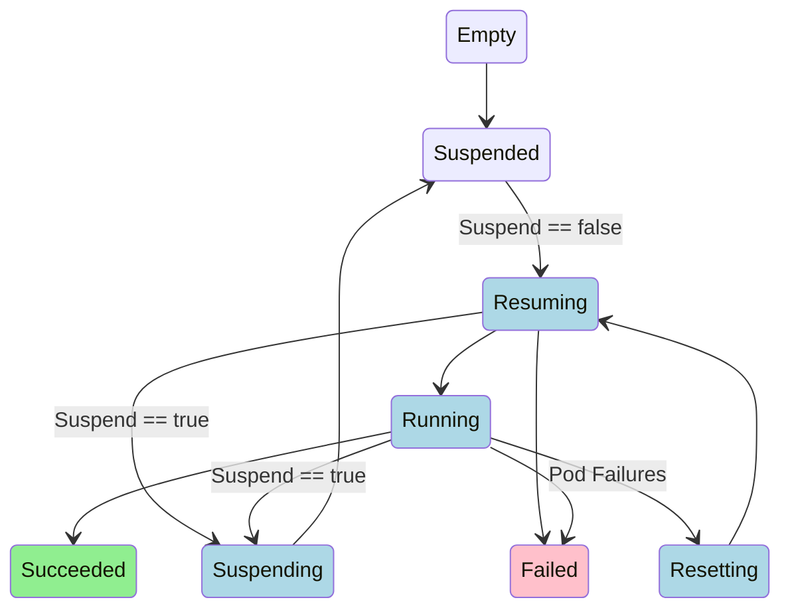

# AppWrapper State Diagram

The state diagram below describes the transitions between the Phases of an AppWrapper. These states are augmented by two orthogonal conditions:
   + QuotaReserved indicates whether the AppWrapper is considered Active by Kueue.
   + ResourcesDeployed indicates whether wrapped resources may exist on the cluster.

QuotaReserved and ResourcesDeployed are both true in states colored blue below.

QuotaReserved and ResourcesDeployed will initially be true in the Failed state (pink),
but will become false when the controller succeeds at deleting the resources created
in the Resuming phase.

ResourcesDeployed will be true in the Succeeded state (green), but QuotaReserved will be false.

Any phase may transition to the Terminating phase (not shown) when the AppWrapper is deleted.
During the Terminating phase, QuotaReserved and ResourcesDeployed may initially be true
but will become false once the controller succeeds at deleting any associated resources.

