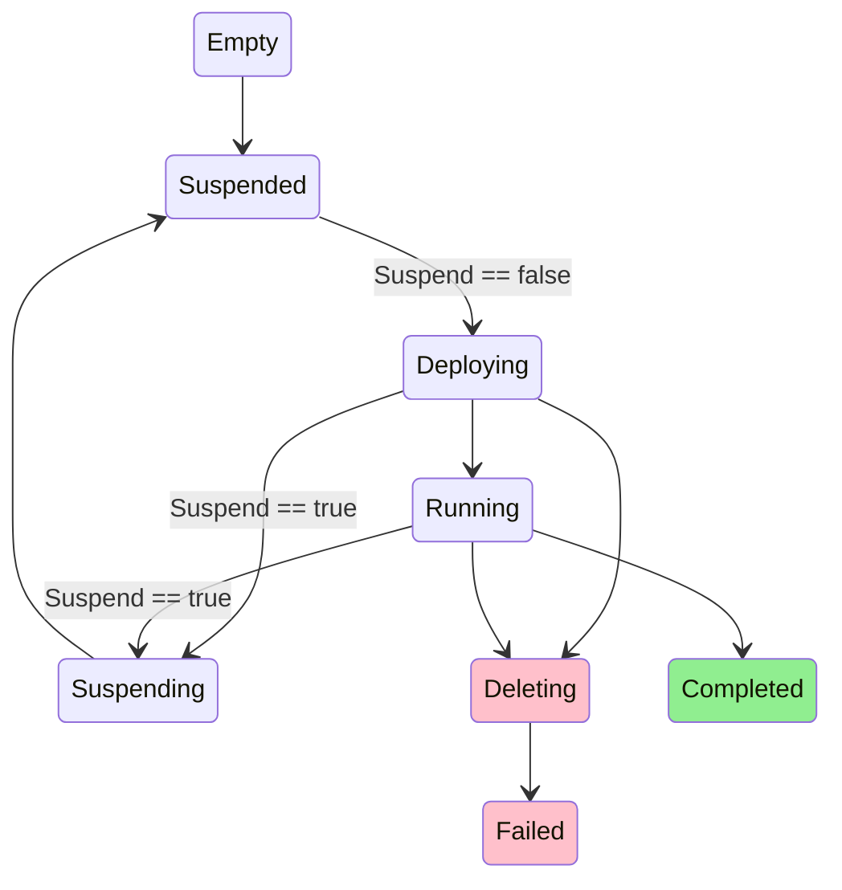

# AppWrapper State Diagram
The following state diagram describes the transitions between the phases of an AppWrapper.

```mermaid
stateDiagram-v2
    e : Empty

    sd : Suspended
    dp : Deploying
    r: Running
    sg: Suspending
    dl: Deleting
    c: Completed
    f: Failed

    %% Happy Path
    e --> sd
    sd --> dp : Suspend == false
    dp --> r
    r --> c

    %% Requeuing
    dp --> sg : Suspend == true
    r --> sg : Suspend == true
    sg --> sd

    %% Failures
    dp --> dl
    r --> dl
    dl --> f


    classDef failed fill:pink
    class dl failed
    class f failed

    classDef succeeded fill:lightgreen
    class c succeeded
```
