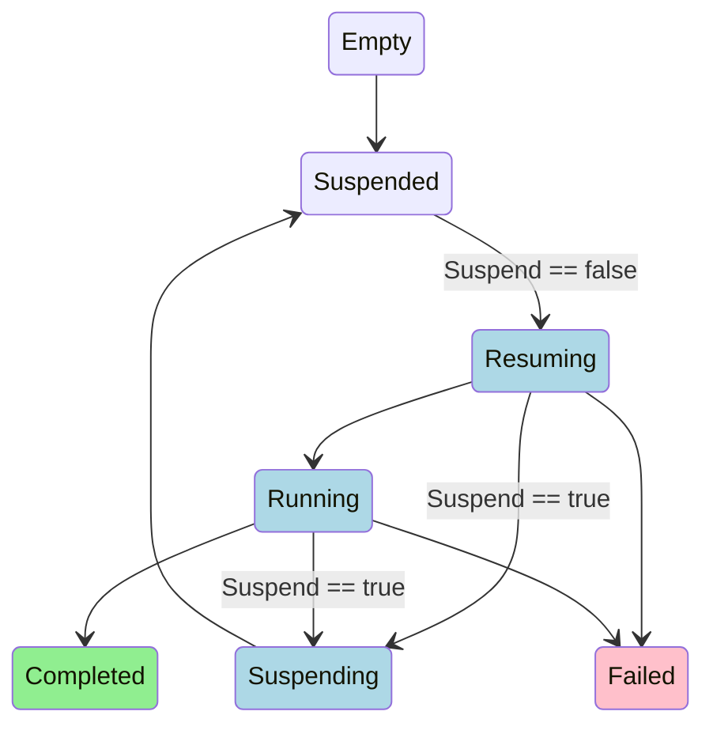

# AppWrapper State Diagram
The state diagram below describes the transitions between the Phases of an AppWrapper.

Two Conditions (ActiveResources, PassiveResources) are used to encode if any of
the wrapped resources may exist on the cluster.  When ActiveResources is true (blue), then
the AppWrapper is considered Active by Kueue. PassiveResources is only true in the
Completed state and does not cause the AppWrapper to be considered Active by Kueue.
Note that in the Failed state (pink), ActiveResources will initially be true and then
transition to false once the controller successfully deletes all resources that were created
in the Resuming phase.

Any phase may transition to the Terminating phase (not shown) when the AppWrapper is deleted.
During the Terminating phase, either ActiveResources or PassiveResources may be true until
the controller successfully deletes all resources that were created in the Resuming phase.

