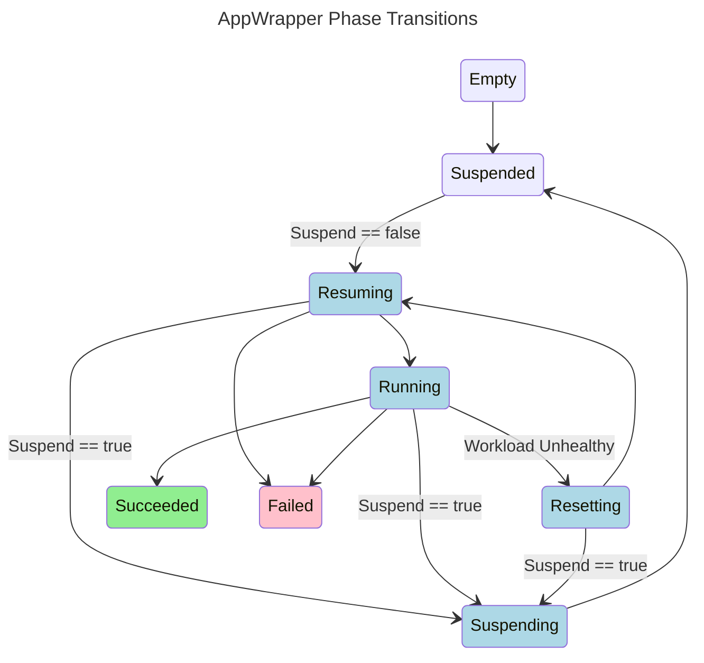

Kueue has a [well-developed pattern](https://kueue.sigs.k8s.io/docs/tasks/dev/integrate_a_custom_job/)
for Kueue-enabling a Custom Resource Definition and its associated operator.

AppWrapper version 1.0.6 and earlier was an *external Kueue integration*
and therefore versions of the AppWrapper controller were closely tied to a matching
Kueue version (Kueue 0.7 through Kueue 0.10).

Starting with Kueue 0.11 and AppWrapper version 1.1, AppWrapper becamse a first class
*built-in Kueue integration*.  This allows a looser coupling between the
two controllers and a significant simplification in their joint deployment and configuration.

#### AppWrapper Controller

The AppWrapper Controller is a standard reconciliation loop that watches AppWrapper instances and
is responsible for all AppWrapper-specific operations including
creating, monitoring, and deleting the wrapped resources in response
to the modifications of the AppWrapper instance’s specification and
status.

The state diagram above depicts the transitions between the Phases of
an AppWrapper.  A label on an edge indicates the state change that will
trigger that transition.  For example, if an AppWrapper is in the
Suspended Phase and Kueue sets `spec.suspend` to `false` then the AppWrapper Controller
will transition the AppWrapper to the Resuming Phase.

These states are augmented by two orthogonal Conditions:
   + **QuotaReserved** indicates whether the AppWrapper is considered Active by Kueue.
   + **ResourcesDeployed** indicates whether wrapped resources may exist on the cluster.

QuotaReserved and ResourcesDeployed are both true in states colored blue below.

QuotaReserved and ResourcesDeployed will initially be true in the Failed state (pink),
but will become false when the AppWrapper Controller succeeds at deleting all resources created
in the Resuming phase.

ResourcesDeployed will be true in the Succeeded state (green), but QuotaReserved will be false.
After a configurable delay, the AppWrapper controller will eventually delete the resources of
Succeeded AppWrappers and ResourcesDeployed will become false.

Any phase may transition to the Terminating phase (not shown) when the AppWrapper is deleted.
During the Terminating phase, QuotaReserved and ResourcesDeployed may initially be true
but will become false once the AppWrapper Controller succeeds at deleting all associated resources.

See [appwrapper_controller.go]({{ site.gh_main_url }}/internal/controller/appwrapper/appwrapper_controller.go)
for the implementation.
