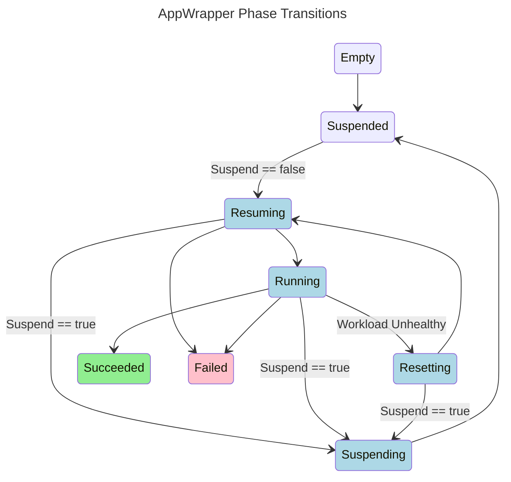

Kueue has a well-developed pattern for Kueue-enabling a Custom
Resource Definition and its associated operator. Following this pattern
allows the resulting operator to smoothly run alongside the core Kueue
operator. The pattern consists of three main elements: an Admission
Controller, a Workload Controller, and a Framework Controller.

#### Admission Controller

Kueue requires the definition of an Admission Controller that ensures
that the `.spec.suspend` field of newly created AppWrapper instances is
set to true. We also leverage the Admission Controller to ensure that
the user creating the AppWrapper is entitled to create all wrapped resources
and to validate AppWrapper-specific invariants.

See [appwrapper_webhook.go]({{ site.gh_main_url }}/internal/webhook/appwrapper_webhook.go)
for the implementation.

#### Workload Controller

The Workload Controller is an instantiation of Kueue’s JobReconciller
along with an implementation of Kueue’s GenericJob interface for
AppWrappers.  As is standard practice in Kueue, this controller will
watch AppWrapper instances and their owned Workload instances to
reconcile the two. This controller makes it possible for Kueue to
suspend and resume the AppWrapper and constrain the placement of pods
created by the wrapped resources of the AppWrapper. It also translates
the status of the AppWrapper to the format expected by Kueue.

See [workload_controller.go]({{ site.gh_main_url }}/internal/controller/workload/workload_controller.go)
for the implementation.

A small additional piece of logic is currently needed to generalize
Kueue's ability to recognize parent/children relationships and ensure
that admission by Kueue of the parent AppWrapper will be propagated to
its immediate children.

See [child_admission_controller.go]({{ site.gh_main_url }}/internal/controller/workload/child_admission_controller.go)
for the implementation.

#### Framework Controller

The Framework Controller is a standard reconciliation loop that watches AppWrapper instances and
is responsible for all AppWrapper-specific operations including
creating, monitoring, and deleting the wrapped resources in response
to the modifications of the AppWrapper instance’s specification and
status made by the Workload Controller described above.

The state diagram above depicts the transitions between the Phases of
an AppWrapper.  A label on an edge indicates the state change that will
trigger that transition.  For example, if an AppWrapper is in the
Suspended Phase and `spec.suspend` becomes False then the Framework Controller
will transition the AppWrapper to the Resuming Phase.

These states are augmented by two orthogonal Conditions:
   + **QuotaReserved** indicates whether the AppWrapper is considered Active by Kueue.
   + **ResourcesDeployed** indicates whether wrapped resources may exist on the cluster.

QuotaReserved and ResourcesDeployed are both true in states colored blue below.

QuotaReserved and ResourcesDeployed will initially be true in the Failed state (pink),
but will become false when the Framework Controller succeeds at deleting all resources created
in the Resuming phase.

ResourcesDeployed will be true in the Succeeded state (green), but QuotaReserved will be false.

Any phase may transition to the Terminating phase (not shown) when the AppWrapper is deleted.
During the Terminating phase, QuotaReserved and ResourcesDeployed may initially be true
but will become false once the Framework Controller succeeds at deleting all associated resources.

See [appwrapper_controller.go]({{ site.gh_main_url }}/internal/controller/appwrapper/appwrapper_controller.go)
for the implementation.
