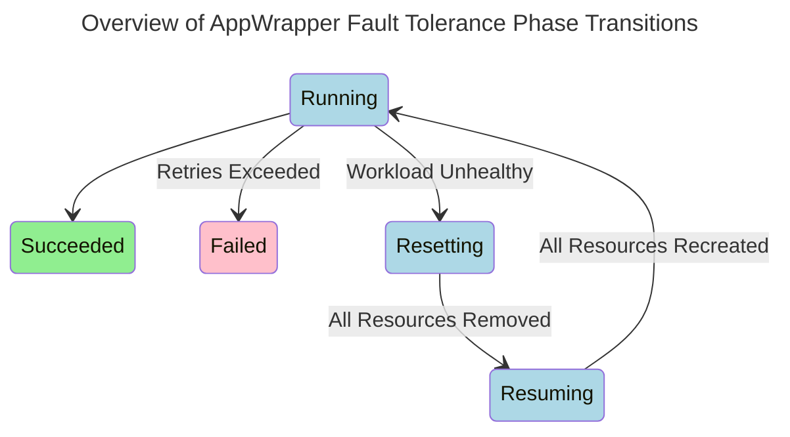

### Overview of Capabilities

The AppWrapper controller is designed to enhance and extend the fault
tolerance capabilities provided by the controllers of its wrapped
resources. Throughout the execution of a workload, the AppWrapper
controller monitors both the status of the contained top-level
resources and the status of all Pods created by the workload. If a
workload is determined to be *unhealthy*, the AppWrapper controller
firsts waits for a bounded time period to allow the underlying
controllers to correct the problem.  If they fail to do so, then the
AppWrapper controller will *reset* the workload by removing all
created resources, and then, if the maximum number of retires has not
been exceeded, recreating the workload. This reset process is carefully
engineered to ensure that it will always make progress and eventually
succeed in completely removing all Pods and other resources created by
a failed workload.

### Progress Guarantees

When the AppWrapper controller decides to delete the resources for a
workload, it proceeds through several phases. First it does a normal
delete of the top-level resources, allowing the primary resource
controllers time to cascade the deletion through all child resources.
If they are not able to successfully delete all of the workload's Pods
and resources within a `ForcefulDeletionGracePeriod`, the AppWrapper
controller then initiates a *forceful* deletion of all remaining Pods
and resources by deleting them with a `GracePeriod` of `0`.  An
AppWrapper will continue to have its `ResourcesDeployed` condition to
be `True` until all resources and Pods are successfully deleted.

This process ensures that when `ResourcesDeployed` becomes `False`,
which indicates to Kueue that the quota has been released, all
resources created by a failed workload will have been totally removed
from the cluster.

### Detailed Description

The `podSets` contained in the AppWrapper specification enable the
AppWrapper controller to inject labels into every Pod that is created
by the workload during its execution. Throughout the execution of the
workload, the AppWrapper controller monitors the number and health of
all labeled Pods. It also watches the top-level created resources and
for selected resources types understands how to interpret their status
information. This information is combined to determine if a workload
is unhealthy. A workload can be deemed *unhealthy* if any of the
following conditions are true:
   + There are a non-zero number of `Failed` Pods.
   + It takes longer than `AdmissionGracePeriod` for the expected
     number of Pods to reach the `Pending` state.
   + It takes longer than the `WarmupGracePeriod` for the expected
     number of Pods to reach the `Running` state.
   + A top-level resource is missing.
   + The status information of a batch/v1 Job or PyTorchJob indicates
     that it has failed.

If a workload is determined to be unhealthy by one of the first three
Pod-level conditions above, the AppWrapper controller first waits for
a `FailureGracePeriod` to allow the primary resource controller an
opportunity to react and return the workload to a healthy state. The
`FailureGracePeriod` is elided by the last two conditions because the
primary resource controller is not expected to take any further
action. If the `FailureGracePeriod` passes and the workload is still
unhealthy, the AppWrapper controller will *reset* the workload by
deleting its resources, waiting for a `RetryPausePeriod`, and then
creating new instances of the resources.

During this retry pause, the AppWrapper **does not** release the workload's
quota; this ensures that when the resources are recreated they will still
have sufficient quota to execute.  The number of times an AppWrapper is reset
is tracked as part of its status; if the number of resets exceeds the `RetryLimit`,
then the AppWrapper moves into a `Failed` state and its resources are deleted
(thus finally releasing its quota).  If at any time during this retry loop,
an AppWrapper is suspended (ie, Kueue decides to preempt the AppWrapper),
the AppWrapper controller will respect this request by proceeding to delete
the resources.

To support debugging `Failed` workloads, an annotation can be added to an
AppWrapper that adds a `DeletionOnFailureGracePeriod` between the time the
AppWrapper enters the `Failed` state and when the process of deleting its resources
begins. Since the AppWrapper continues to consume quota during this delayed deletion period,
this annotation should be used sparingly and only when interactive debugging of
the failed workload is being actively pursued.

All child resources for an AppWrapper that successfully completed will be automatically
deleted after a `SuccessTTL` after the AppWrapper entered the `Succeeded` state.

### Configuration Details

The parameters of the retry loop described about are configured at the operator level
and can be customized on a per-AppWrapper basis by adding annotations.
The table below lists the parameters, gives their default, and the annotation that
can be used to customize them.

| Parameter                    | Default Value | Annotation                                                             |
|------------------------------|---------------|------------------------------------------------------------------------|
| AdmissionGracePeriod         |      1 Minute | workload.codeflare.dev.appwrapper/admissionGracePeriodDuration         |
| WarmupGracePeriod            |     5 Minutes | workload.codeflare.dev.appwrapper/warmupGracePeriodDuration            |
| FailureGracePeriod           |      1 Minute | workload.codeflare.dev.appwrapper/failureGracePeriodDuration           |
| RetryPausePeriod             |    90 Seconds | workload.codeflare.dev.appwrapper/retryPausePeriodDuration             |
| RetryLimit                   |             3 | workload.codeflare.dev.appwrapper/retryLimit                           |
| DeletionOnFailureGracePeriod |     0 Seconds | workload.codeflare.dev.appwrapper/deletionOnFailureGracePeriodDuration |
| ForcefulDeletionGracePeriod  |    10 Minutes | workload.codeflare.dev.appwrapper/forcefulDeletionGracePeriodDuration  |
| SuccessTTL                   |        7 Days | workload.codeflare.dev.appwrapper/successTTLDuration                   |
| GracePeriodMaximum           |      24 Hours | Not Applicable                                                         |

The `GracePeriodMaximum` imposes a system-wide upper limit on all other grace periods to
limit the potential impact of user-added annotations on overall system utilization.
